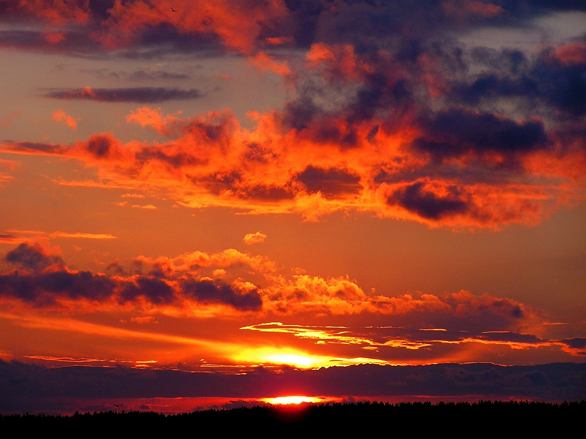

## Markdown muotoiluja:


## Kuva malliksi:

## Kakkostason otsikko

Korostuksia:

 * italics: _underscores - italics_. (Cmd + i)
 * Strong: **two asterisks-Strong** (Cmd + b)
 * Strikethrough: ~~two tildes-Strikethrough~~ (Cmd + h)

1. Listan jäsen
2. Listan jäsen
3. Listan jäsen
   1. Listan jäsen
   2. Listan jäsen

Taulukon otsikko | Taulukon otsikko2 | Taulukon otsikko3
Taulukon solu | Taulukon solu | Taulukon solu
Taulukon solu | Taulukon solu | Taulukon solu
